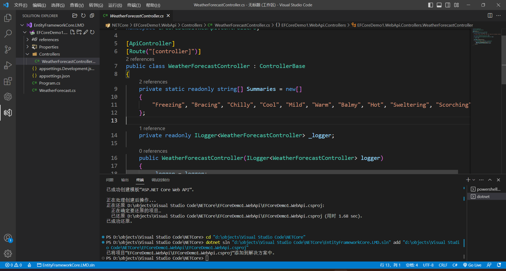

在C#中，常用的访问数据库的手段一般是使用Ado.NET，调用Ado.NET的接口来完成对数据库的各种操作，比如：增、删、改、查等等。Ado.NET的性能很高，也很灵活，因为可以自由的编写SQL语句，同时对内存的消耗也较小。

但Ado.NET 也有一些缺点：

* 需要手动编写SQL语句，增加了开发的复杂度和出错的可能性；
* 不支持面向对象的编程模式，需要手动将数据对象和数据库表进行映射，这会降低代码的可读性和可维护性
* 不支持语言集成查询（LINQ），需要使用字符串拼接的方式来构造动态查询，这会影响代码的安全性和效率。
* 不支持实体框架，比如EF，和其他高级别的数据访问抽象，需要自己实现数据层和业务层之间的逻辑，这会增加开发的工作量和难度。

为了提高开发效率，减少出错的可能性等等，可以使用Entity Framework Core（EF Core）。


# 什么是ORM

ORM（Object Relational Mapping，对象关系映射），“对象”指的就是C#中的对象，“关系”就是指关系数据库，比如：SQL Server、MySQL、Oracle、SQLite 等等。“映射”指的在关系数据库和C#对象之间搭建一座桥梁。ORM可以像操作C#对象的方式操作数据库，而不需要手动编写SQL语句。ORM只是对ADO.NET 的封装，底层还是通过ADO.NET访问数据库。

ORM框架：**EFCore**、Dapper、FreeSql、SqlSugar、Chloe、PetaPoco等等。

# EFCore 的优点

Entity Framework（EF）Core 是轻量化、可扩展、开源和跨平台版的常用数据访问技术。

它有以下优点

* EFCore支持 LINQ 查询、更改跟踪、更新和架构迁移，可以提高开发效率和代码质量
* EFCore支持 CodeFirst 和 DbFirst 模式，可以根据数据库生成模型，或者根据模型创建数据库
* EFCore支持多种模型开发方法，可以使用数据注释、Fluent API 或约定来配置模型
* EFCore支持多对多导航、阴影状态属性、备用键、表拆分、实体拆分、全局查询筛选器等高级功能


# 如何使用EF Core

一、创建 Asp.Net Core WebApi 项目



先启动项目看看是否可以正常运行，如果运行出错，可能是由于HTTPS没有正确配置，可以把下面划线部分去掉


在浏览器地址栏中输入正确的URL，如：

```
localhost:分配的端口号/swagger/index.html
```

出现以下界面，则表示项目成功运行


二：安装EFCore所需要的包，使用Nuget包管理器进行安装。

* Microsoft.EntityFrameworkCore.SqlServer
* Microsoft.EntityFrameworkCore.Tools：EFCore生成数据库的工具，否则执行Add-Migration等命令时会提示错误信息：无法将Add-Migration项识别为 cmdlet、函数、脚本文件或可运行程序的名称。

如果使用MySQL数据库就安装这个：Pomelo.EntityFrameworkCore.MySql

三：创建实体类，和数据表中的字段对应：


进行相关配置：


* ```C#
  protected override void OnModelCreating(ModelBuilder modelBuilder)
  {
  	  base.OnModelCreating(modelBuilder);
      modelBuilder.ApplyConfigurationsFromAssembly(this.GetType().Assembly);
  }
  ```

  * 官方解释：重写此方法以进一步配置根据约定从派生上下文的属性中 DbSet 公开的实体类型发现的模型。 生成的模型可能会被缓存并重新用于派生上下文的后续实例。[微软文档地址](https://learn.microsoft.com/zh-cn/dotnet/api/microsoft.entityframeworkcore.dbcontext.onmodelcreating?view=efcore-7.0)
  * modelBuilder：用于为此上下文构造模型的生成器。 数据库 (和其他扩展) 通常在此对象上定义扩展方法，以便配置特定于给定数据库的模型的各个方面。
  * 个人理解：模型的上下文已经提前初始化完成，如果派生类再次重写此方法还可以进行进一步的配置，最后使用派生类进一步配置好的模型配置。

四：在“程序包管理器控制台”中输入命令

* Add-Migration InitialCreate
* Update-database

如果执行Update-database出错的话，把Up和Down方法中的代码都删掉就可以了


创建一个新的API控制器，写四个方法：


创建文件夹 services，新建两个文件 IPersonService 和 PersonVice


再Program.cs中添加范围服务


然后在PersonController控制器进行构造函数注入


启动项目


选择Select，执行后可以发现所有的数据均已查出


